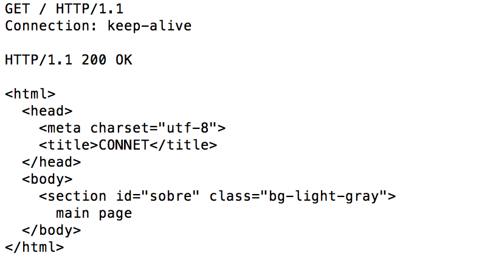

# python_socket

### Methods accepted: 
* HEAD
* GET
### Headers processed: 
* Connection
### Connection types: 
* 'close'
* 'keep-alive'

### Example
#### Terminal: 
$ telnet localhost 8080

#### Telnet: 
* GET example with keep-alive connection type

  

* HEAD example with default (close) connection type

  
